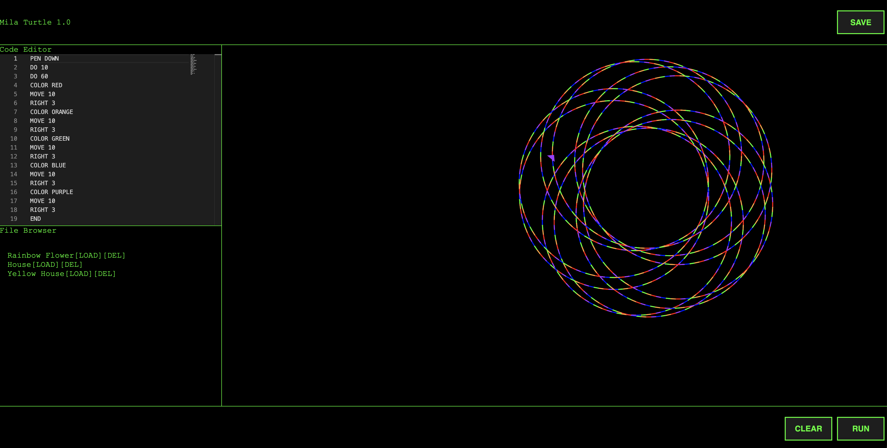

## Mila Turtle 1.0

This is a simple fun little Logo program written in React that compiles instructions to the little turtle on the screen so it can draw beautiful colorful shapes.

This is a great learning tool for young children to start getting into computer programing.



## Install

After cloning the repo run the following command

#### With npm

```js
npm install
npm start
```

#### With Yarn

```
yarn
yarn start
```

## Local Development

Currently there isn't support for a hot module swapping local dev server. The app needs to be killed and respawned so the front end can be built and deployed. Future work will include adding a hot module swapping solution

## Language

The language is really easy to learn! Here are the commands that are used to control the little turtle and make great sprites!

| Command  | Argument                           | Description                                                                                                  | Example     |
| -------- | ---------------------------------- | ------------------------------------------------------------------------------------------------------------ | ----------- |
| `RIGHT`  | `number`                           | Rotate the turtle to the right by a number of degress                                                        | `RIGHT 90`  |
| `LEFT`   | `number`                           | Rotate the turtle to the left by a number of degress                                                         | `LEFT 90`   |
| `MOVE`   | `number`                           | Move the turtle ahead by a number of pixels                                                                  | `MOVE 100`  |
| `PEN`    | `'down'\|'up'`                     | Put the pen either down to draw or up to stop drawing                                                        | `PEN DOWN`  |
| `DO`     | `number`                           | Begin a loop. Every instruction after a `DO` and before an `END` is looped for the specified number of times | `DO 20`     |
| `END`    | `undefined`                        | Marks the end of the looped instruction set                                                                  | `END`       |
| `CENTER` | `undefined`                        | Instructs the turtle to retrun to the center of the canvas in its current orientation                        | `CENTER`    |
| `DIR`    | `'north'\|'south'\|'east'\|'west'` | Rotate the turtle to one of the 4 standard orientations                                                      | `DIR NORTH` |

## Contributions

Would love some contributions to this!
